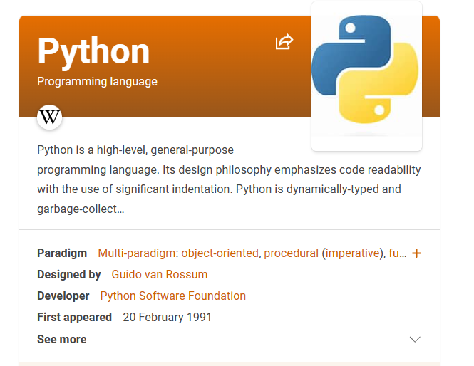

# Python 编程入门
> 陈希章 2023-1-18

  

## 概述

这是 `Think python` 这本书的中文版的改编，并且尤其侧重于如何让没有编程经验的大学生能真的上手学习和实践。

《Think Python》 是一本经典的Python（或者叫计算机编程）入门图书，原作者是 `Allen B. Downey（艾伦 唐尼）`，英文原版在线阅读地址是 <https://www.greenteapress.com/thinkpython2/html/index.html>， 你也可以下载到PDF的版本：<http://www.greenteapress.com/thinkpython2/thinkpython2.pdf>。

《Think Python》有多个中文翻译版本，也都免费发行。我参考的是这个版本 <https://github.com/apachecn/think-py-2e-zh>，在线阅读地址是 <https://think-py.apachecn.org/>，感谢作者和译者的工作。

## 改编原因

这个也是我给外甥辅导的教材，改编的目的在于去除一些暂时用不到的内容，并且增加一些对初学者更加有帮助的内容（例如如何安装Python，调试等）。

## 资源地址

1. 电子书在线阅读地址是 <https://python.book.xizhang.com>
1. 下载到 PDF 版本 <https://github.com/chenxizhang/thinkpython/releases>
1. 提交issue反馈 <https://github.com/chenxizhang/thinkpython/issues>

