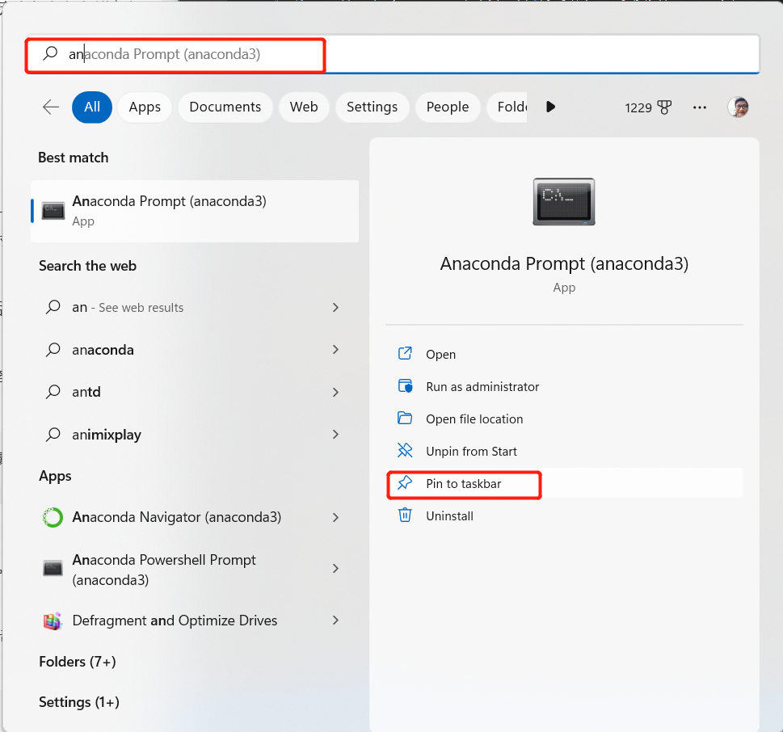
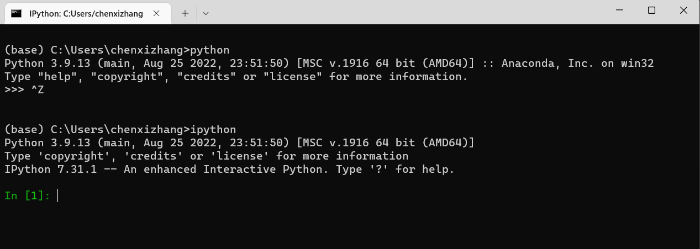

# 第一章 编程之路

本书的目的是教你学会像计算机科学家一样来思考。这种思考方式汇聚了数学、工程和自然科学的精华。计算机科学家像数学家一样，使用规范的语言来阐述思想（尤其是一些计算）；像工程师一样设计、组装系统，并且在多重选择中寻找最优解；像自然科学家一样观察复杂系统的行为模式，建立猜想，测试预估的结果。

计算机科学家唯一最重要的技能就是『解决问题』。解决问题意味着要有能力把问题进行方程化，创造性地考虑解决思路，并且清晰又精确地表达出解决方案。而学习编程的过程，正是一个培养这种解决问题能力的绝佳机会。本章的标题是『编程之路』，原因就在此。

> 🎇陈希章：**解决问题** 这个能力是最重要的，不管你是不是从事计算机和软件开发工作。**计算思维** 是另外一个术语，这是由原卡耐基·梅隆大学（CMU）计算机系主任周以真教授（Jeannette M. Wing）在2006年首次提出，并发表在《Communications of the ACM》杂志。周教授认为：计算思维是运用计算机科学的基础概念进行问题求解、系统设计、以及人类行为理解等涵盖计算机科学之广度的一系列思维活动。有关计算思维的更多说明，请参考 [这里](https://baike.baidu.com/item/%E8%AE%A1%E7%AE%97%E6%80%9D%E7%BB%B4/4689456) 的介绍。

在一定层面上，大家将通过编程本身来学习编程这一重要的技巧。在另外一些层面上，大家也将把编程作为实现一种目的的途径。这一目的会随着我们逐渐学习而越发清楚。

## 1.1  程序是什么？

程序是一个指令的序列，来告诉机器如何进行一组运算。这种运算也许是数学上的，比如求解一组等式或者求多项式的根；当然也可以是符号运算，比如在文档中搜索和替换文字，或者一些图形化过程，比如处理图像或者播放一段视频。

不同编程语言的具体细节看着很不一样，但几乎所有编程语言都会有一些基础指令：

* 输入系统：从键盘、文件、网络或者其他设备上获得数据。

* 输出系统：将数据在屏幕中显示，或者存到文件中、通过网络发送等等。

* 数学运算：进行基本的数学操作，比如加法或者乘法。

* 条件运算：检查特定条件是否满足来运行相应的代码。

* 重复操作：重复进行一些操作，通常每次操作会有些变化。

大家刚开始接触编程的话，可能还有点难以置信，核心内容仅仅上述这些而已。你用过的所有程序，无论多么复杂，都是由一些这样的指令组合而成的。因此大家可以把编程的过程理解成一个把庞大复杂任务进行拆分来解决的过程，分解到适合使用上述的基本指令来解决为止。

>🎇陈希章：请再次想一想前面提到的 **计算思维** 和 **解决问题** 的能力。

## 1.2  运行 Python

新手在刚接触 Python 的时候遇到的困难之一就是必须在电脑上安装 Python 和相关的一些软件。如果你熟悉操作系统，并且还很习惯用命令行接口，那安装 Python 对你来说就没啥问题了。但对初学者来说，要求他们既要了解系统管理又要学习编程，就可能有些困难了。

为了避免这种问题，我推荐大家可以在开始的时候用浏览器来体验 Python。熟悉了之后，再安装 Python 到计算机上。

有很多站点提供在线运行 Python 的功能。如果你已经用过并且有一定经验了，可以选择你喜欢的。我推荐大家可以试试 PythonAnywhere，对此的使用介绍可以在[这个链接](http://tinyurl.com/thinkpython2e)中找到。

>🎇陈希章：由于一些网络层面的原因，`pythonanywher.com` 这个网站在国内访问速度比较慢，所以我还是建议本地安装。这里以 Windows 11 环境为例介绍如何安装。跟其他任何事情一样，安装 Python 也有多种方式。我这里只介绍最为简单和实用的一种，这就是安装 [Annaconda](https://www.annaconda.com) 公司的一个特殊发行版，它打包了Python（这个本身是开源免费的），以及其他一些工具，让基于Python的编程和数据分析（以及人工智能应用开发）变得从未如此简单。虽然 Python 确实也能做网页，或者一些脚本工具，但目前应用最广泛的领域其实还是数据科学。
> 
> 1. 下载。你可以通过 [官方网站](https://docs.conda.io/en/latest/miniconda.html) 找到下载链接。注意，Annaconda其实提供了两个版本，一个是完整版，一个是精简版。我这里推荐的是精简版。
> 1. 安装。在磁盘上找到刚才下载文件，这是一个以 Annaconda 开头并以 exe 结尾的文件，双击该文件，按照步骤完成安装，在安装向导中全部选择默认选项。
> 1. 验证。安装完成后，点击 Windows 徽标键，然后搜索 `annaconda` 这个关键字，可以找到一个 `Annaconda Prompt` 的工具，以后你就是用这个工具来编写和运行Python程序了。为了方便起见，你可以将它固定在任务栏。
      
> 打开这个命令行窗口，输入 `python` 然后回车，你可以看到如下的界面，这就表示安装成功了。
      
> 按下 `Ctrl + Z` 组合键可以退出 Python 界面，回到正常的命令行界面。输入 `ipython` 然后回车，可以看到一个不一样的Python窗口。
      
> 这个交互式的窗口（正如它的名字那样）给了我们更好的编程和调试体验，我在后续都将以这个模式介绍。

Python 现在有两个主要的分支版本，即 Python2 和 Python3。如果你学过其中的一个，你会发现他们还挺相似的，而且转换起来也不算难。实际上对于初学者来说，他们只有很细微的差别而已。这本书是用 Python3 写的，但也会对 Python2 进行注解。

Python 的解释器是一个读取并执行 Python 代码的程序。根据你的系统环境，你可以点击图标或者在命令行中输入 python 来运行解释器。它运行起来，你会看到类似这样的输出：

```py
Python 3.4.0 (default, Jun 19 2015, 14:20:21)  
[GCC 4.8.2] on linux 
Type "help", "copyright", "credits" or "license" for more information. 
>>>  
>>>  
```

开头的三行包含了关于解释器和所在操作系统的信息，所以大家各自的情况可能有所不同。不过当你检查版本的时候，比如例子中的是 3.4.0，使用 3 开头的，那就告诉你了，他运行的是 Python3。你肯定也能猜到，如果开头的是 2 那就是 Python2 咯。

最后一行那个是提示符，告诉你解释器已经就绪了，你可以输入代码了。如果你输入一行代码然后回车键，解释器就会显示结果了，如下所示：

```py
>>> 1 + 1 
>>> 1 + 1 
2
```
现在你已经做好开始学习 Python 的准备了。现在我估计你应该已经知道怎么来启动 Python 解释器和运行 Python 代码了。

## 1.3  第一个程序

传统意义上，大家学一门新编程语言要写的第一个程序都被叫做『Hello，World！』，因为这第一个程序就用来显示这个词组『Hello，World！』。在 Python 中，是这样实现的：

```py
>>> print('Hello, World!') 
>>> Hello, World! 
```
这是一个打印语句的例子，虽然并没有往纸张上面进行实际的『打印』。这个程序把结果显示在屏幕上。结果就是输出了这个词组『Hello，World！』

括号表明了 print 是一个函数。关于函数我们到第三章再讨论。

在 Python2 中，打印的语句有一点点不一样：print 不是一个函数，所以就不用有括号了。

```py
>>> print 'Hello, World!' 
>>> Hello, World! 
```

这个区别以后会理解更深入，现在说这点就够了。

## 1.4  运算符

在『Hello，World！』之后，下一步就是运算了。Python 提供了运算符，就是一些用来表示例如加法、乘法等运算的符号了。

运算符+，-和*表示加法、减法和乘法，如下所示：

```py
>>> 40 + 2 
>>> 40 + 2 
42 
>>> 43 - 1 
>>> 43 - 1 
42 
>>> 6 * 7 
>>> 6 * 7 
42 
```

运算符右斜杠/意味着除法：

```py
>>> 84 / 2 
>>> 84 / 2 
42.0 
```

你估计在纳闷为啥结果是 42.0 而不是 42，这个下一章节我再解释。


最后，再说个运算符**，它表示乘方，就是前一个数为底数，后一个数为指数的次幂运算：

```py
>>> 6**2 + 6 
>>> 6**2 + 6 
42 
```

在其他的一些编程语言中，^这个符号是乘方的意思，但在 Python 中这是一个位运算操作符叫做『异或』。要是你不熟悉位运算操作符，结果一定让你很惊讶：

```py
>>> 6 ^ 2 
>>> 6 ^ 2 
4 
```


我在本书中不会涉及到位运算，但你可以在下面这个链接里面读一下来了解：[Wiki](http://wiki.python.org/moin/BitwiseOperators)。

## 1.5  值和类型

值就是一个程序操作的基本对象之一，比如一个字母啊，或者数字。刚刚我们看到了一些值的例子了，比如 2，42.0，还有那个字符串『Hello，World！』

这些值属于不同的类型：2 是一个整形值，42.0 是浮点数，『Hello，World！』是字符串咯。之所以叫字符串就是因为有一串字符。（译者注：这本书的作者真心掰开揉碎地讲解每一个点啊，高中生甚至初中生都应该理解起来没有什么问题，所以大家用这本书来学编程绝对是最佳选择了。）

如果你不确定一个值是什么类型呢，你可以让解释器来告诉你：

```py
>>> type(2) 
>>> type(2) 
<class 'int'> 
>>> type(42.0) 
>>> type(42.0) 
<class 'float'> 
>>> type('Hello, World!') 
>>> type('Hello, World!') 
<class 'str'> 
```

在这些例子中，『class』这个字样表明这是一类，一种类型就是对值的一种划分。


很自然了，整形的就是 int 了，字符串就是 str 了，浮点数就是 float 了。


那'2' 和 '42.0'这种是啥呢？他们看着像是数字，但带了单引号了。

```py
>>> type('2') 
>>> type('2') 
<class 'str'> 
>>> type('42.0') 
>>> type('42.0') 
<class 'str'> 
```

真相就是字符串了。


咱们现在输入一个大的整数，在中间用逗号分隔试试看，比如 1，000，000，并不是 Python 中合乎语法的整形，但也被接受了：

```py
>>> 1,000,000 
>>> 1,000,000 
(1, 0, 0) 
```

出乎意料吧，Python 把逗号当做了分隔三个整形数字的分隔符了。我们以后再对这种序列进行讨论。

## 1.6  公式语言和自然语言

自然语言就是人说的语言，比如英语、西班牙语、法语，当然包括中文了。他们往往都不是人主动去设计出来的（当然，人会试图去分析语言的规律），自然而然地发生演进。


公式语言是人们为了特定用途设计出来的。比如数学的符号就是一种公式语言，特别适合表达数字和符号只见的关系。化学家也用元素符号和化学方程式来表示分子的化学结构。要注意的是：

编程语言是一种用来表达运算的公式语言。
公式语言有严格的语法规则和对语句结构的要求。比如数学式 3+3=6 是正确的，而 3+=3￥6 就不是了。化学上 H2O 是正确的化学式，而 2Zz 就不是。

语法规则体现在两个方面，代号和结构。 代号是语言的基础元素，比如单词、数字以及化学元素。3 += 3 $ 6 这个式子数学上无意义的一个原因就是因为 $ 并不是数学上的符号 (至少我所学的数学是没有这个符号的)。类似地， 2Zz 也不对，因为没有一种化学元素的缩写是 Zz.

第二个语法规则是代号必须有严格的组合结构。3 += 3 这个式子数学上错误就因为虽然这些符号都是数学符号，但不能把加号等号放一起。类似地，化学方程式中要先写元素名字后写个数，而不是反着。

    This is @ well-structured Engli$h sentence with invalid t*kens in it. This sentence all valid tokens has, but invalid structure with.

这句英语的单词和结构都有错误，大家还是能看懂的哈。（译者注，作者故意这样写，来表明人类的自然语言容错率高。）

你读一句英语或者公式语言中的语句时候，你必须搞清楚结构（虽然在自然语言中大家潜意识就能搞定了）。这就叫做解译。

虽然公式语言和自然语言有很多共同特征，比如代号、结构、语法这些元素，但差别还是显著的，比如：


*   二义性 ambiguity:

自然语言充满二义性，也就是歧义了，人们有时候用上下文线索或者其他信息来帮助处理这种情况。公式语言被设计为尽量不具有二义性，这就意味着一个语句往往只有唯一的一种含义，与上下文无关。

*   冗余性 redundancy:

为了弥补歧义，减少误解，自然语言有很多冗余，结果就是经常有废话。公式语言要精简的多。

*   文字修辞 literalness:

自然语言充满习语和隐喻等。比如我说 “The penny dropped”, 可能并不是字面意思说硬币掉了(这个俚语意思是过了一会终于弄明白了)。公式语言的意思严格精准。 

咱们大家都是说着自然语言长大的，要调节到公式语言有时候挺难的。这两者之间的差别有点像诗词和散文，但差别更大：


>*   诗词 Poetry:

单词的运用要兼顾词义和押韵，诗的整体要有一定的意境或者情感上的共鸣。双关很常见，并且多是故意的。

>*   散文 Prose:

文字意思更重要，结构也有重要作用。相比诗词更好理解，但也有一定的双关语歧义。

>*   程序 Programs:

计算机程序的意义必须是无歧义和文采修饰的，能完全用代号和结构的方式进行解析。

公式语言比自然语言要更加密集，读起来也需要更长时间。公式语言的结构也非常重要，所以从头到尾或者从左到右未必就是最佳方式。大家应该学着动脑来解译程序，分辨代号，解析结构。最后要注意的就是在公式语言中，细节特别特别重要。拼写和符号的小错误对于自然语言来说没什么，但对公式语言来说就能带来大问题。

## 1.7  调试

程序员也会犯错的。由于很奇妙的原因，程序的错误被叫做 bug，调试的过程就叫 debug 了。（译者注：一个传言是最早的计算机中经常有虫子进去导致短路之类的，清理虫子就成了常规调试的操作，流传至今。。。）

编程，尤其是调试的过程，有时候会给人带来强烈的挫败感。面对特别复杂的状况，你可能就感到愤怒、压抑，或者特别难受。

别担心，这些都是正常人对计算机的正常反应。计算机工作正常了，我们会觉得他们像是队友一样；一旦工作出错了，对我们很粗暴，我们对他们的反应就像是对待粗暴可恨的人一样（参考 Reeves 和 Nass，The Media Equation: How People Treat Computers, Television, and New Media Like Real People and Places）。

为这些反应做好心理准备，这样你在遇到类似情况就更好应对了。我们也可以把计算机当做一个有一定优点但也有特定缺陷的员工，比如速度快精度高，但缺乏共鸣和应对大场面的能力。

你的工作就是做个好的经理人：尽量充分利用员工优势并降低他们缺陷的作用。然后想办法把你的情绪用在解决问题上，而不要让过激的反应干扰工作效率。

调试的过程挺烦人的，但这个本领很有价值，而且在编程之外的其他领域都有用武之地。在每一章的末尾，都会有这样的一段，我会给出一些关于调试方面的建议。希望能帮到大家！

## 1.8  Glossary 术语列表
problem solving:
The process of formulating a problem, finding a solution, and expressing it.

>问题解决：将问题方程化，找到解决方案，并表达出来的过程。

high-level language:
A programming language like Python that is designed to be easy for humans to read and write.

>高级语言：例如 Python 这样的编程语言，设计初衷为易于被人阅读和书写。

l
ow-level language:
A programming language that is designed to be easy for a computer to run; also called “machine language” or “assembly language”.

>低级语言：设计初衷为易于被计算机运行的语言，比如机器语言和汇编语言。

portability:
A property of a program that can run on more than one kind of computer.

>可移植性：程序能运行于多种平台的特性。

interpreter:
A program that reads another program and executes it

>解释器：一边读取一边执行代码的程序。

prompt:
Characters displayed by the interpreter to indicate that it is ready to take input from the user.

>提示符：解释器显示的，提醒用户准备就绪，随时可以输入。

program:
A set of instructions that specifies a computation.

>程序：进行一种特定运算的一系列指令。

print statement:
An instruction that causes the Python interpreter to display a value on the screen.

>打印语句：让 Python 解释器输出值到屏幕的指令。

operator:
A special symbol that represents a simple computation like addition, multiplication, or string concatenation.

>运算符（操作符）：一系列特殊的符号，表示一些简单的运算，比如加减乘除或者字符串操作。

value:
One of the basic units of data, like a number or string, that a program manipulates.

>值：数据的基本组成单元，比如数字或者字符串，是程序处理的对象。

type:
A category of values. The types we have seen so far are integers (typeint), floating-point numbers (type float), and strings (type str).

>类型：对值的分类，大家刚刚接触到的有整形 int，浮点数 float，以及字符串 str。

integer:
A type that represents whole numbers.
整形：就是整数咯。
floating-point:
A type that represents numbers with fractional parts.

>浮点数：简单说，就是有小数点的数了。

string:
A type that represents sequences of characters.

>字符串：一串有序的字符了。

natural language:
Any one of the languages that people speak that evolved naturally.

>自然语言：人们说的语言，自然地演化。

formal language:
Any one of the languages that people have designed for specific purposes, such as representing mathematical ideas or computer programs; all programming languages are formal languages.

>公式语言：人为设计的用于特定用途的语言，比如数学用途或者计算机编程用的；所有编程语言都是公式语言。

token:
One of the basic elements of the syntactic structure of a program, analogous to a word in a natural language.

>代号：程序结构中的一种基本元素，相当于自然语言中的单词。

syntax:
The rules that govern the structure of a program.

>语法：程序语言结构的规则。

parse:
To examine a program and analyze the syntactic structure.

>解译：理解程序并分析语法结构的过程。

bug:
An error in a program.

>Bug：程序的错误。

debugging:
The process of finding and correcting bugs.

>调试（debug）：搜索和改正程序错误的过程。

## 1.9  练习
### 练习 1

你读这本书的同时最好手边有台电脑，这样你就能把样例在电脑上随时运行来看看效果了。

无论你学任何一种新功能的时候，都可以试着犯点错误。比如就在这个『Hello，World！』程序，你可以试试去掉一个引号会怎么样，都去掉会怎么样，print 这个单词拼错了会怎么样等等。

这种尝试能让你对读到的内容有更深刻的记忆；也有助于你编程，因为你在编程的时候也得知道调试信息的意思。所以最好现在就故意犯些错误来看看，比以后毫无准备地遇到要好多了。

1.	在 print 语句后面的括号去掉一个或者两个，看看会怎么样？

2.	Print 字符串的时候如果你丢掉一个引号或者两个引号试试看会如何？

3.	输入一个负数试试，比如-2。然后再试试在数字前面添加加号会怎么样？比如 2++2。

4.	数学上计数用零开头是可以得，比如 02，在 Python 下面试试会怎样？

5.	两个值中间没有运算符会怎么样？
